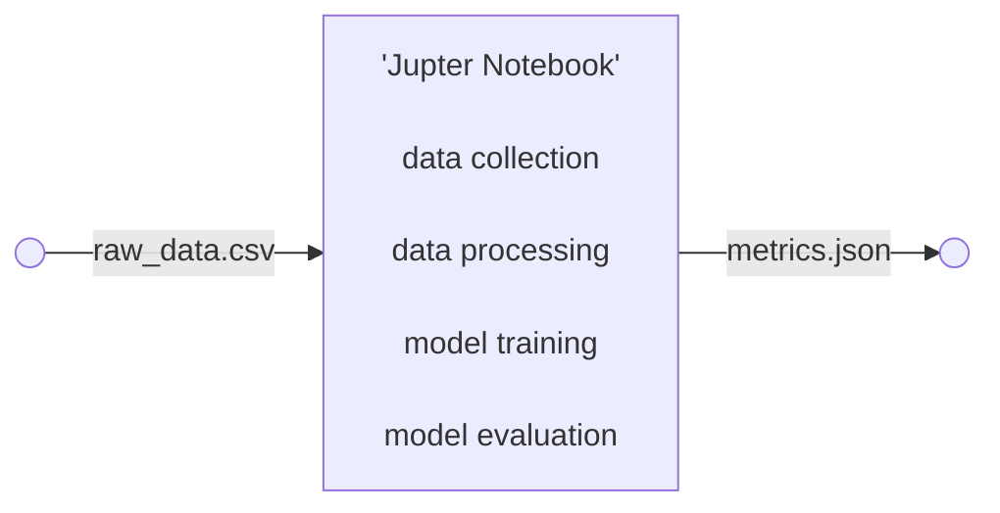
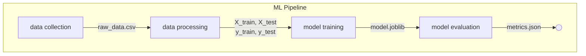
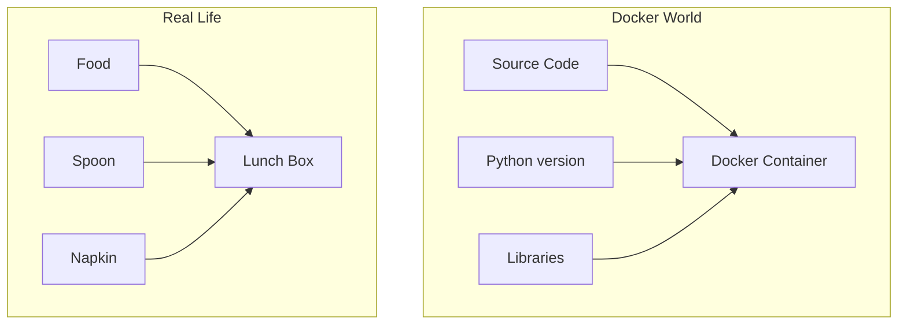
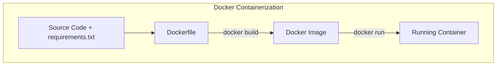
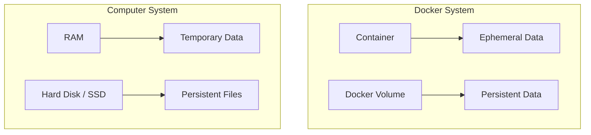
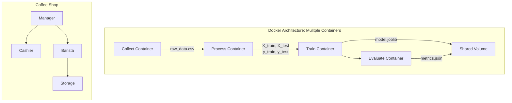

# Introduction to  Docker for MLOPs

## Concepts Covered:
- Jupyteer Notebooks to Scripts (Modularization)
- Local Environment to Docker Container (Containerization)
- Docker Container with Volumes
- Docker Compose : Mulitple Containers

## 1. Jupyter Notebooks to Scripts (Modularization)



### Code Splitted


## 2. Local Environment to Docker Container (Containerization)

Issues faced in case of portability:
- Python version mismatch
- OS dependency issues
- Missing libraries

### What is Docker Container?
A lunch box carries everything needed for the meal.
A Docker container carries everything needed for the application.

### How Docker Containerization works?

- The Dockerfile is like the recipe.
- Docker reads the recipe and creates a reusable image.
    ```bash
    docker build -t iris-pipeline .
    ```
- A running instance of the image becomes a container.
    ```bash
    docker run --rm --name iris-run iris-pipeline
    ```


The whole ML pipeline is encapsulated inside the Docker Container.
The directory structure now looks like this:


**Optimization**: Used .dockerignore to keep the image lightweight. It prevents the local files (like pycache or older models) from being copied to the image, which can slow down the build process and increase the image size.

## 3. Docker Container with Volumes
The main drawback of Docker Container is that the data produced by the pipeline is lost once the container is stopped. To fix this, we introduce volumes.

### What are Volumes?
Containers are like RAM — fast and temporary.
Volumes are like hard drives — persistent and long-lasting



We create two volumes, /app/data and /app/models, that are mounted to the host machine. This allows the data and models to persist even after the container is stopped.

To fix this in a clean way, we use Docker Compose.

- Start a service called ml-pipeline.
- Build the image from the Dockerfile in the current directory.
- Mount the ./data directory on the host to the /app/data directory in the container.
- Mount the ./models directory on the host to the /app/models directory in the container.


## 4. Docker Compose : Mulitple Containers

Docker Compose is a tool that lets you define and run multiple Docker containers together using a single configuration file called docker-compose.yml.



We can think of the architecture like this:


The entire pipeline can be executed by a single command.

```bash
docker compose up
```
Don't forget to stop the containers using.

```bash
docker compose down
```


