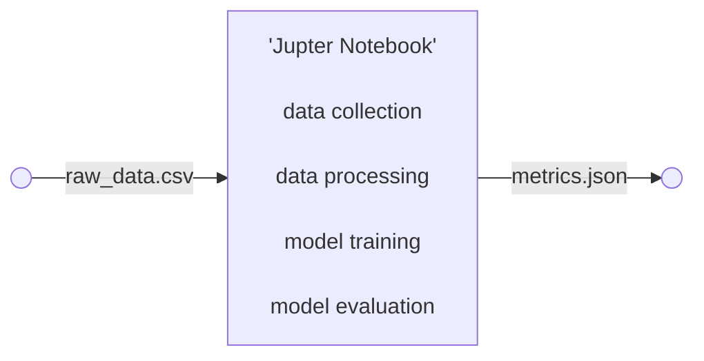
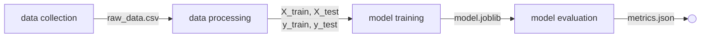
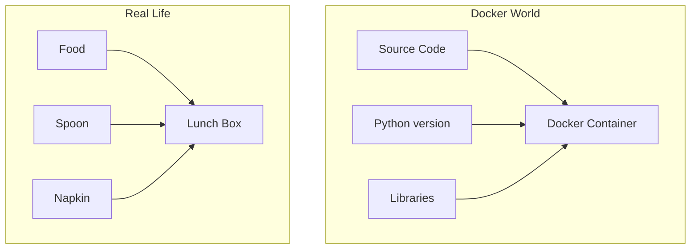
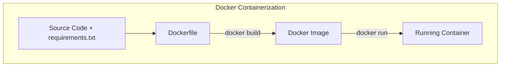
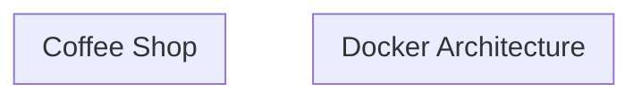

# Using Docker for MLOPs

## 1. Jupyter Notebook to Scripts



### Code Splitted


## 2. From Local Environment to Docker Container

Issues faced in case of portability:
- Python version mismatch
- OS dependency issues
- Missing libraries

### What is Docker Container?
A lunch box carries everything needed for the meal.
A Docker container carries everything needed for the application.

### How Docker works?

- The Dockerfile is the recipe.
- Docker reads the recipe and creates a reusable image.
```bash
docker build -t iris-pipeline .
```
- A running instance of the image becomes a container.
```bash
docker run --rm --name iris-run iris-pipeline
```


    

